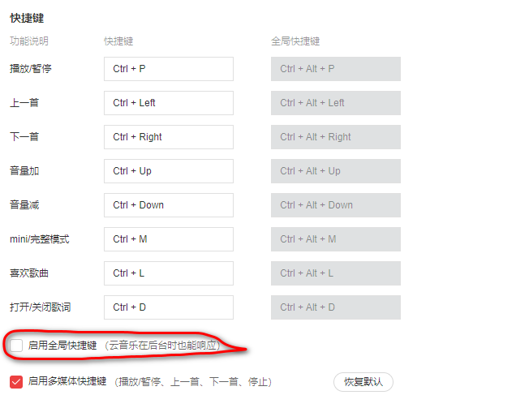

# 快速生成HTML结构

1.生成标签 直接输入标签名按tab键即可 比如 div 然后tab键，就可以生成`

`

2.如果想要生成多个相同标签 加上*就可以了比如 div*3 就可以快速生成3个div 

3.如果有父子级关系的标签，可以用>比如 ul>+li就可以了

4.如果有兄弟关系的标签，用+就可以了比如div+p

5.如果生成带有类名或者id名字的div，直接写.demo 或者#two tab 键就可以了

6.如果生成的div类名是有顺序的，可以用自增符号$

7.如果想要在生成的标签内部写内容可以用`{}`表示

# 快速生成CSS样式语法
 
CSS基本采取简写形式即可，

1.比如w200 按tab可以生成 width:200px;

2.比如Ih26 按tab 可以生成 line-height:26px;

# 快速格式化代码
WebStorm：`Ctrl+Alt+L`

ps:网易云设置里面圈起来这个选项会影响WebStorm快捷键，建议关掉

