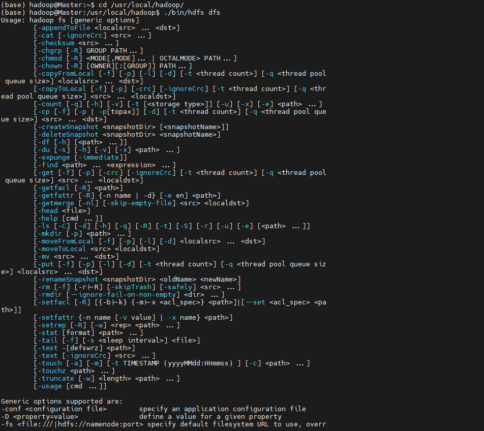
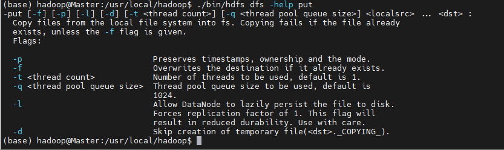
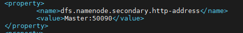
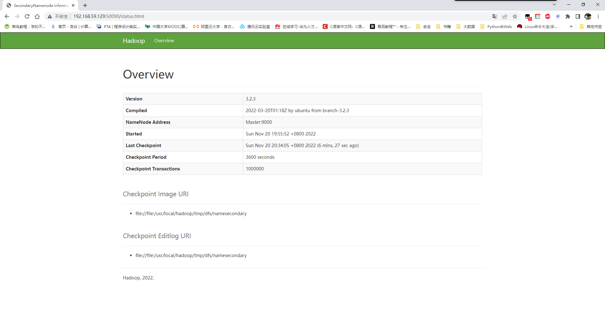

# 利用Shell命令与HDFS进行交互
Hadoop支持很多Shell命令，其中fs是HDFS最常用的命令，利用fs可以查看HDFS文件系统的目录结构、上传和下载数据、创建文件等。

下文示例命令是以"./bin/hadoop dfs"开头的Shell命令方式，实际上有三种shell命令方式。
1. `hadoop fs`
2. `hadoop dfs`
3. `hdfs dfs`

`hadoop fs`适用于任何不同的文件系统，比如本地文件系统和HDFS文件系统
`hadoop dfs`只能适用于HDFS文件系统
`hdfs dfs`跟`hadoop dfs`的命令作用一样，也只能适用于HDFS文件系统


# 查看命令使用方法
启动Hadoop后可以在终端输入如下命令，查看`hdfs dfs`，总共支持哪些操作。
```
 cd /usr/local/hadoop/      # 进入hadoop安装目录
./bin/hdfs dfs
```
上述命令执行后，会显示类似如下的结果(这里直接去了部分命令)




`hdfs dfs`命令的统一格式是类似`hdfs dfs -ls`这种形式，即在`-`后面跟上具体的操作。
查看某个命令的作用，例如，当需要查询put命令的具体用法时，可以采用如下命令：
`./bin/hdfs dfs -help put`
输出如下：



# HDFS目录&文件操作
## 目录操作
需要注意的是，Hadoop系统安装好以后，第一次使用HDFS时，需要首先在HDFS中创建用户目录。本教程全部采用hadoop用户登录Linux系统，因此，需要在HDFS中为hadoop用户创建一个用户目录，命令如下：
```
cd /usr/local/hadoop
./bin/hdfs dfs -mkdir -p /user/hadoop
```
该命令中表示在HDFS中创建一个“/user/hadoop”目录，“–mkdir”是创建目录的操作，“-p”表示如果是多级目录，则父目录和子目录一起创建，这里“/user/hadoop”就是一个多级目录，因此必须使用参数“-p”，否则会出错。“/user/hadoop”目录就成为hadoop用户对应的用户目录。
可以使用如下命令显示HDFS中与当前用户hadoop对应的用户目录下的内容：
` ./bin/hdfs dfs -ls .`
该命令中，“-ls”表示列出HDFS某个目录下的所有内容，“.”表示HDFS中的当前用户目录，也就是“/user/hadoop”目录，因此，上面的命令和下面的命令是等价的：
`./bin/hdfs dfs -ls /user/hadoop`
如果要列出HDFS上的所有目录，可以使用如下命令：
`./bin/hdfs dfs -ls`
下面，可以使用如下命令创建一个input目录：
`./bin/hdfs dfs -mkdir input`
在创建个input目录时，采用了相对路径形式，实际上，这个input目录创建成功以后，它在HDFS中的完整路径是“/user/hadoop/input”。如果要在HDFS的根目录下创建一个名称为input的目录，则需要使用如下命令：
`./bin/hdfs dfs -mkdir /input`
可以使用rm命令删除一个目录，比如，可以使用如下命令删除刚才在HDFS中创建的“/input”目录（不是“/user/hadoop/input”目录）：
`./bin/hdfs dfs -rm -r /input`
上面命令中，“-r”参数表示如果删除“/input”目录及其子目录下的所有内容，如果要删除的一个目录包含了子目录，则必须使用“-r”参数，否则会执行失败。
hdfs dfs后面的参数基本和linux系统相关命令一致，所以如果有linux基础很好上手
## 文件操作
在实际应用中，经常需要从本地文件系统向HDFS中上传文件，或者把HDFS中的文件下载到本地文件系统中。
首先，使用vim编辑器，在本地Linux文件系统的“/home/hadoop/”目录下创建一个文件myLocalFile.txt，里面可以随意输入一些单词，比如，输入如下三行：
```
Hadoop
Spark
XMU DBLAB
```
然后，可以使用如下命令把本地文件系统的“/home/hadoop/myLocalFile.txt”上传到HDFS中的当前用户目录的input目录下，也就是上传到HDFS的“/user/hadoop/input/”目录下：
`./bin/hdfs dfs -put /home/hadoop/myLocalFile.txt  input`
可以使用ls命令查看一下文件是否成功上传到HDFS中，具体如下：
`./bin/hdfs dfs -ls input`
该命令执行后会显示类似如下的信息：
```
Found 1 items   
-rw-r--r--   1 hadoop supergroup         36 2017-01-02 23:55 input/ myLocalFile.txt
```
下面使用如下命令查看HDFS中的myLocalFile.txt这个文件的内容：
`./bin/hdfs dfs –cat input/myLocalFile.txt`
下面把HDFS中的myLocalFile.txt文件下载到本地文件系统中的“/home/hadoop/下载/”这个目录下，命令如下：
`./bin/hdfs dfs -get input/myLocalFile.txt  /home/hadoop/`
可以使用如下命令，到本地文件系统查看下载下来的文件myLocalFile.txt：
```
cd ~
ls
cat myLocalFile.txt
```
最后，了解一下如何把文件从HDFS中的一个目录拷贝到HDFS中的另外一个目录。比如，如果要把HDFS的“/user/hadoop/input/myLocalFile.txt”文件，拷贝到HDFS的另外一个目录“/input”中（注意，这个input目录位于HDFS根目录下），可以使用如下命令：
`./bin/hdfs dfs -cp input/myLocalFile.txt  /input`

# 利用Web界面管理HDFS
浏览器访问Hadoop  Master节点ip:50070,上面的端口取决于你配置文件`/usr/local/hadoop/etc/hadoop/hdfs-site.xml`写的多少，如下图我写的50090，所以我访问50090端口



即可看到HDFS的web管理界面




<center>

如果您乐意，感谢支持~


</center>