# HTML

### 特殊字符

<center>

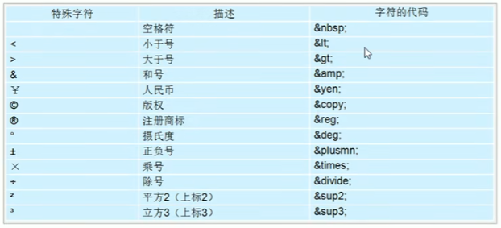

</center>

### 表格
表格由 `<table> `标签来定义。每个表格均有若干行（由 `<tr>` 标签定义），每行被分割为若干单元格（由 `<td>` 标签定义）。
实例：
```
<table>
    <tr>
        <td>row 1, cell 1</td>
        <td>row 1, cell 2</td>
    </tr>
    <tr>
        <td>row 2, cell 1</td>
        <td>row 2, cell 2</td>
    </tr>
</table>
```

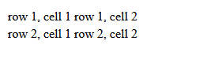

在此基础上，`<th>`则可以表示表头，`<thead>`表示表格头部，`<tbody>`表示表格主题，以上3个标签其实显示效果没有明显差别，有助于结构划分。
* `<table>`标签

常用属性：

`align`:表格的对其当方式，参数：left、center、right。

`border`:表格是否有边框，参数：1（有）或 0（没有）。

`cellpadding`:单元格内容与单元格边框之间的距离，单位为像素。

`cellspacing`：单元格之间的距离，单位为像素。

`width`：单元格宽度，单位为像素。

`height`单元格高度，单位为像素。
* 单元格合并

跨行合并：`rowspan="合并单元格的个数"`；要合并的单元格中，最上侧单元格为目标单元格，写合并代码。

跨列合并：`colspan="合并单元格的个数"`；要合并的单元格中，最左侧单元格为目标单元格，写合并代码。
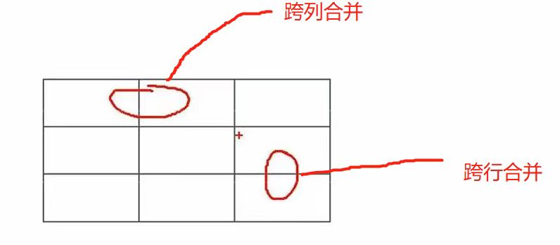

合并步骤：先确定是跨行合并还是跨列合并-->找到目标单元格，写上合并方式=合并的单元格数量-->删除多余的单元格
```
<table border="1" cellspacing="0" align="center" width="500" height="249">
    <tr>
        <td>row 1, cell 1</td>
        <td>row 1, cell 2</td>
        <td>row 1, cell 3</td>
    </tr>
    <tr>
        <td>row 2, cell 1</td>
        <td>row 2, cell 2</td>
        <td>row 2, cell 3</td>
    </tr>
    <tr>
        <td>row 3, cell 1</td>
        <td>row 3, cell 2</td>
        <td>row 3, cell 3</td>
    </tr>
</table>
```
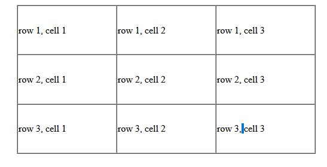

```
<table border="1" cellspacing="0" align="center" width="500" height="249">
    <tr>
        <td>row 1, cell 1</td>
        <td colspan="2">row 1, cell 2</td>
        <td>row 1, cell 3</td>
    </tr>
    <tr>
        <td>row 2, cell 1</td>
        <td>row 2, cell 2</td>
        <td>row 2, cell 3</td>
    </tr>
    <tr>
        <td>row 3, cell 1</td>
        <td>row 3, cell 2</td>
        <td>row 3, cell 3</td>
    </tr>
</table>
```
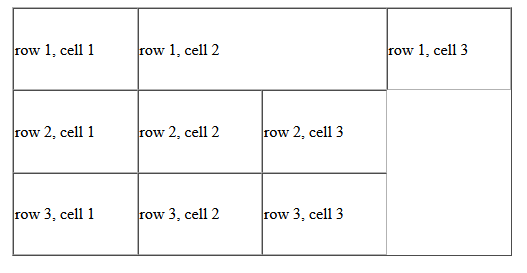

```
<table border="1" cellspacing="0" align="center" width="500" height="249">
    <tr>
        <td>row 1, cell 1</td>
        <td colspan="2">row 1, cell 2</td>
    </tr>
    <tr>
        <td>row 2, cell 1</td>
        <td>row 2, cell 2</td>
        <td>row 2, cell 3</td>
    </tr>
    <tr>
        <td>row 3, cell 1</td>
        <td>row 3, cell 2</td>
        <td>row 3, cell 3</td>
    </tr>
</table>
```
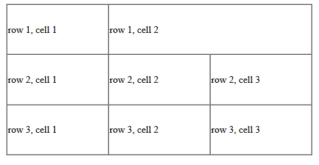


### 列表
* 无序列表
```
<ul>
    <li>列表项1</li>
    <li>列表项2</li>
    <li>列表项3</li>
</ul>
```
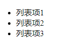

* 有序列表
```
<ol>
    <li>列表项1</li>
    <li>列表项2</li>
    <li>列表项3</li>
</ol>
```
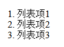

* 自定义列表
在HTML标签中,`<dl>`标签用于定义描述列表（或定义列表）,该标签会与 `<dt>`（定义项目/名字）和`dd`（描述每一个项目/名字）一起使用。
```
<dl>
    <dt>列表项1</dt>
    <dd>列表项2</dd>
    <dd>列表项3</dd>
</dl>
```
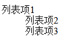


### 表单
在HTML中，一个完整的表单通常由表单域、表单控件（也称为表单元素）和提示信息3个部分构成。
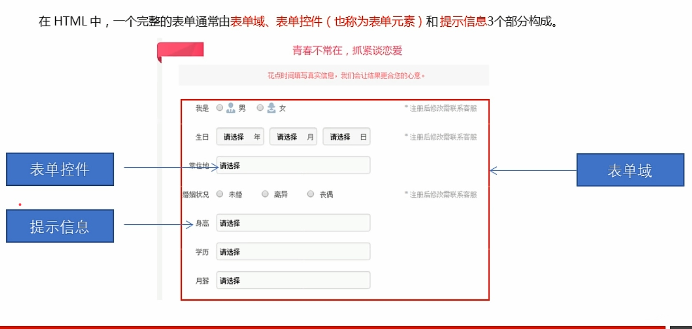

表单控件中可以定义各种表单元素，这些表单元素就是允许用户在表单中输入或者选择的内容控件。

主要类型：

&emsp;&emsp;1、**input输入表单元素**
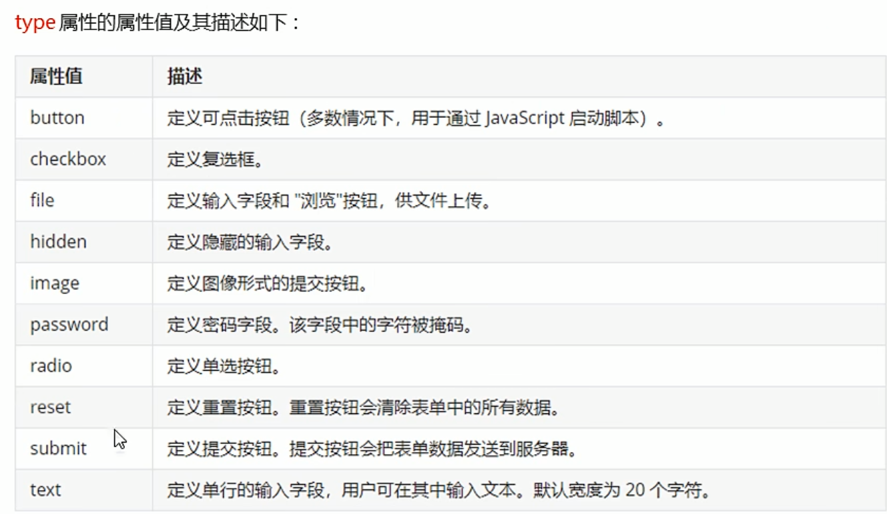

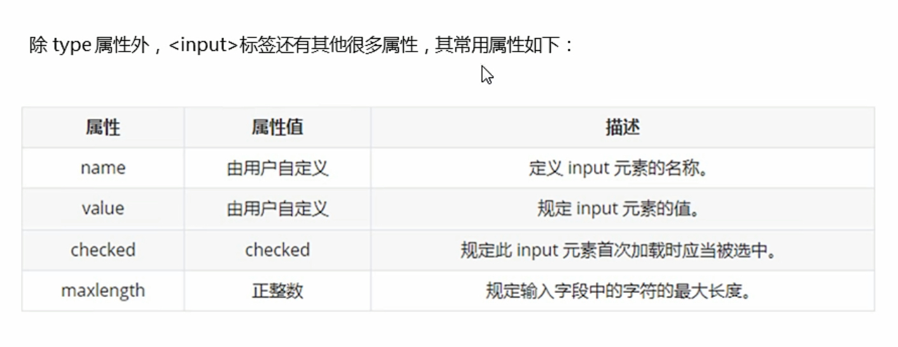

```
<form   action="http://localhost" method="post" name="name1">
<!--    text 文本框 用户可以在里面输入任何文字-->
<!--    maxlength 规定输入的最大字符数-->
    用户名：<input type="text" name="username" value="请输入用户名" maxlength="6"><br>
<!--    name 是表单元素名称 单选按钮和复选复选框各自不同项此属性必须保持一致-->
<!--    value 是input元素的值-->
<!--    name和value 是提供给后台服务器的，主要给后台开发人员看-->
<!--    password 密码框 用户看不见具体输入的值-->
    密码：<input type="password" name="password"><br>
<!--    radio 单选 按钮可以实现多选一-->
<!--    单选按钮和复选框可以设置checked属性，当页面打开的时候就可以默认选中这个按钮-->
   性别:男<input type="radio" name="sex" value="man" checked="checked"> 女<input type="radio" name="sex" value="woman"><br>
<!--    checkbox 复选框 可以实现多选-->
   爱好：吃饭<input type="checkbox" name="hobby" value="eating" checked="checked">睡觉<input   checked="checked" type="checkbox" name="hobby" value="sleping">看电影<input type="checkbox" name="hobby" value="watching movie"><br>
<!--    点击了提交按钮，可以把表单域form里面的表单元素里面的值 提交给后台服务器-->
    <input type="submit" value="提交">
<!--    重置按钮可以还原表单元素初始的默认状态-->
    <input type="reset" value="重新填写">
<!--    普通按钮button 后期搭配js脚本使用-->
    <input type="submit" value="获取短信验证码"><br>
<!--    文件域 使用场景:上传文件使用的-->
    上传头像:<input type="file">
</form>
```
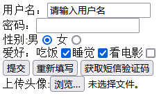

label标签

`<label>`标签为input元素定义标注（标签）。

`<label>`标签用于绑定一个表单元素，当点击`<label>`标签内的文本时，浏览器就会自动将焦点（光标）转到或者对应的表单元素上，用来增加用户体验。
语法
```
性别:
    <label for="nan">男</label>
    <input type="radio" name="sex" value="man" id="nan" checked="checked">
    <label for="nv">女</label>
    <input type="radio" name="sex" value="woman" id="nv"><br>
```
`<label>`标签的for属性应当与相关元素的id属性值相同

&emsp;&emsp;2、**select下拉表单元素**
```
<form   action="http://localhost" method="post" name="name1">
<!--<select>中至少包含一对<option>-->
<!--在<option>中定义selected = “selected”时，当前项即为默认选中项    -->
    籍贯:
    <select>
        <option>山东</option>
        <option>河南</option>
        <option>河北</option>
        <option>天津</option>
        <option>北京</option>
        <option>云南</option>
        <option selected="selected">深圳</option>
        <option>香港</option>
        <option>黑龙江</option>
    </select>
</form>
```
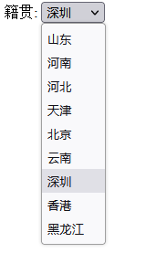

&emsp;&emsp;3、**textarea文本域元素**

在表单元素中，`<textarea>`标签是用于定义多行文本输入的控件。

使用多行文本输入控件，可以输入更多的文字，该控件常见于留言板，评论。
语法:
```
<form   action="http://localhost" method="post" name="name1">
    今日反馈:
    <textarea cols="50" rows="5">cols 是规定一行的字数，rows是规定显示的行数，多出的行数需要滚动条滑动
    </textarea>
</form>
```
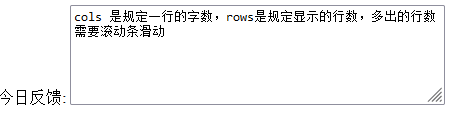


# CSS

### HTML中引入CSS的方式

* 内联方式

内联方式指的是直接在 HTML 标签中的 style 属性中添加 CSS。

示例：
```
<div style="background: red"></div>
```
这通常是个很糟糕的书写方式，它只能改变当前标签的样式，如果想要多个 `<div>` 拥有相同的样式，你不得不重复地为每个 `<div>` 添加相同的样式，如果想要修改一种样式，又不得不修改所有的 style 中的代码。很显然，内联方式引入 CSS 代码会导致 HTML 代码变得冗长，且使得网页难以维护。

* 嵌入方式

嵌入方式指的是在 HTML 头部中的 `<style>` 标签下书写 CSS 代码。

示例：
```
<head>
    <style>

    .content {
        background: red;
    }

    </style>
</head>
```
嵌入方式的 CSS 只对当前的网页有效。因为 CSS 代码是在 HTML 文件中，所以会使得代码比较集中，当我们写模板网页时这通常比较有利。因为查看模板代码的人可以一目了然地查看 HTML 结构和 CSS 样式。因为嵌入的 CSS 只对当前页面有效，所以当多个页面需要引入相同的 CSS 代码时，这样写会导致代码冗余，也不利于维护。

* 链接方式

链接方式指的是使用 HTML 头部的 <head> 标签引入外部的 CSS 文件。

示例：
```
<head>
    <link rel="stylesheet" type="text/css" href="style.css">
</head>
```
这是最常见的也是最推荐的引入 CSS 的方式。使用这种方式，所有的 CSS 代码只存在于单独的 CSS 文件中，所以具有良好的可维护性。并且所有的 CSS 代码只存在于 CSS 文件中，CSS 文件会在第一次加载时引入，以后切换页面时只需加载 HTML 文件即可。

* 导入方式

导入方式指的是使用 CSS 规则引入外部 CSS 文件。

示例：
```
<style>
    @import url(style.css);
</style>
```

### CSS选择器

* 基础选择器（由单个选择器组成）:标签选择器、类选择器、id选择器和通配符选择器

标签选择器：html标签名作为选择器，选中页面中所有的此标签。

类选择器:选中所有相同类的标签。(需要在html标签中加上类名，多个类名之间用空格隔开)
语法:
```
.类名 {

}
```

id选择器:选中所有相同id的标签。（需要在html标签上加上id）
语法:
```
#id名 {

} 
```

通配符选择器:使用`*`定义，它表示选取页面中所有元素（标签）。
语法:
```
* {


}
```

### CSS字体属性：

* CSS字体复合属性
```
font: font-style font-weight font-size/line-height font-family;
```
**注意:** 以上顺序不可变，必须严格遵守。不需要设置的属性可以省略（系统会取默认值），但必须保留font-size和font-family属性，否则font属性将不起作用。

* CSS字体属性总结
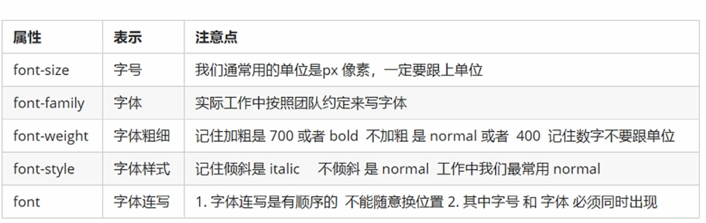

### CSS文本属性

* 装饰文本

`text-decoration`属性规定添加到文本的修饰。可以给文本添加下划线、删除线、上划线等。
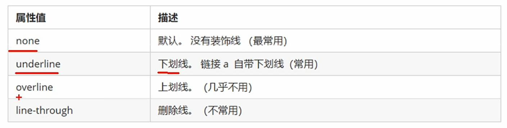

* 文本缩进
`text-indent`属性用来指定文本的第一行的缩进，通常是将段落的首行缩进。正值是缩进，负值是突出。

这边有一个常用的单位：em 
em是一个相对单位，就是当前元素（font-size）一个文字的大小，如果当前元素没有设置大小，则会按照父元素的1个文字大小。

示例：
```
p {
    text-indent: 20px;
}

```

* 行间距
`line-height`属性用于设置行间的距离（行高）。可以控制文字行与行之间的距离.


* 文本属性总结
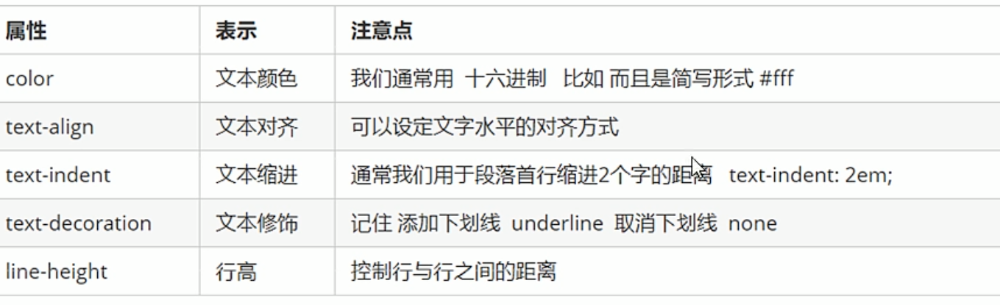

* 后代选择器

后代选择器又称为包含选择器，可以选择父元素里面子元素。其写法就是把外层标签写在前面，内层标签写在后面，中间用空格分隔。当标签发生嵌套时，内层标签就成为外层标签的后代。

语法:

`元素1  元素2{样式声明}`

元素1和元素2中间用空格隔开

元素1是父级，元素2是子级，最终选择的是元素2

元素2可以是儿子，也可以是孙子等，只要是元素1的后代即可

元素1和元素2可以是任意基础选择器

* 子选择器

子元素选择器（子选择器）只能选择作为某元素的最近一级子元素。

语法:

`元素1>元素2{样式声明}`

* 并集选择器（重要）

并集选择器可以选择多组标签，同时为他们定义相同的样式。通常用于集体声明。

并集选择器是各选择器通过英文逗号连接而成，任何形式的选择器都可以作为并集选择器的一部分。

语法:

`元素1,元素2{样式声明}`

上述语法表示选择元素1和元素2.

约定的语法规范，我们并集选择器喜欢竖着写。特别注意，最后一个选择器后面不需要加逗号

* 伪类选择器

伪类选择器用于向某些选择器添加特殊的效果，比如给链接添加特殊效果，或选择第1个，第n个元素。
伪类选择器语法最大的特点是用冒号表示，比如:hover、:first-child

链接伪类选择器:

```
a:link        /* 选择所有未被访问的连接 */
a:visited    /* 选择所有已被访问的连接 */
a:hover     /* 选择鼠标指针位于其上的链接 */
a:active   /* 选择活动链接(鼠标按下未弹起的链接)   */

```

链接伪类选择器注意事项：

1、为了确保生效，请按照**LVHA**的顺序声明(`:link,:visited,:hover,:hover`)

2、因为a链接在浏览器中具有默认样式，所以我们实际工作中都需要给链接单独指定样式。

```
/* 
a是标签选择 所有的链接
 */
a {
    color: grey;
}

/*  
:hover 是链接伪类选择器 鼠标经过
 */
a:hover {
    color: red;
}
```

focus伪类选择器

:focus伪类选择器用于选取获得焦点的表单元素。

焦点就是光标，一般情况<input>类表单元素才能获取，因此这个选择器也主要针对于表单元素来说。

```
input:focus {
    background-color: yellow;
}

```

* 复合选择器总结


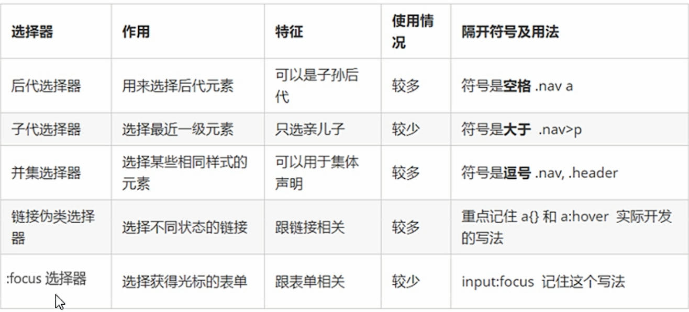

* CSS的元素显示模式

什么是元素显示模式？

元素显示模式就是元素（标签）以什么方式进行显示。

HTML元素一般分为块元素和行内元素两种类型

块元素

常见的块元素有`<h1>~<h6>、<p>、<div>、<ul>、<ol>、<li>`等，其中`<div>`标签是最典型的块元素

块级元素的特点:

1、比较霸道，自己独占一行。

2、高度，宽度、外边距以及内边距都可以控制。

3、宽度默认是容器（父级宽度）的100%。

4、是一个容器及盒子，里面可以放行内或者块级元素。

注意:文字类的元素内不能使用块级元素，比如：`<p>、<h1>~<h6>`

行内元素

常见的行内元素有`<a>、<strong>、<b>、<em>、<i>、<del>、<s>、<ins>、<u>、<span>`等，其中`<span>`标签是最典型的行内元素。有的地方也将行内元素称为内联元素。

行内元素的特点:

1、相邻行内元素在一行上，一行可以显示多个

2、高、宽直接设置是无效的。

3、默认宽度就是它本身内容的宽度。

4、行内元素只能容纳文本或其他行内元素。

注意:1、链接里面不能在放链接；2、特殊情况链接`<a>`里面可以放块级元素，但是给<a>转换一下块级模式最安全


# Webstorm快捷键

快速格式化代码：`ctrl+alt+l`

回到上一步操作：`ctrl+z`


<center>

# 如果您乐意感谢支持


</center>