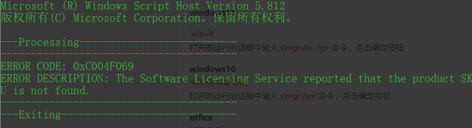

## 起因
网上好多windows激活方式及工具，无外乎密钥、KMS、数字授权、电话激活等
能用的密钥少之又少，数字授权和主板等硬件绑定，电话激活收费。这些方式要么收费要么安全性堪忧。
KMS相较之下是个不错的选择，网上也有好多大佬搭建的给大家用的KMS激活服务器。（网上好多傻瓜式激活工具底层原理就是KMS+免费KMS服务器）
但是KMS免费服务器是有一定安全隐患的，谁也不知道互联网的另一端或者中间出什么问题。如果把这个过程放在自己拥有绝对控制权的局域网下安全性就很高--在局域网内搭建KMS服务器激活，或者直接用虚拟机搭建KMS服务器激活。

感谢大佬~

项目源地址：[VLMCSD](https://github.com/Wind4/vlmcsd)
## KMS简介
Key Management Service（简称:KMS），这个功能是在Windows Vista之后的产品中的一种新型产品激活机制，目的是Microsoft更好的遏制非法软件授权行为(盗版)。
由于Windows VL都是为批量激活而诞生，所以在一个激活单位中肯定会有很多台配置相等的计算机，并用一个服务器建立起一个局域网（LAN），而KMS正好利用这一点，它要求局域网中必须有一台KMS服务器，KMS服务器的作用是给局域网中的所有计算机的操作系统定周期(一般是180天)提供一个随机的激活ID(不同于产品激活密钥)，然后计算机里面的KMS服务就会自动将系统激活，实现正常的系统软件服务与操作。
能够通过KMS进行激活的一般称为VL版,即VOLUME授权版，一般不会单独在零售市场进行发售，一般是直接向企业提供电子ISO映像进行批量授权安装，基于对KMS原理研究成果，我们可以自行搭建KMS激活服务器，实现每180天一次的自动激活，使得系统一直保持激活状态。
KMS服务器的工作原理很快被某些大神研究出来，于是，大神写出了模拟KMS服务端的程序，现在公网上有很多提供kms服务的服务器，只要你能跟这些服务器保持周期性的连接，你就可以用他们激活微软产品，并且保持永久激活。当然，由于大神研究出来的这些模拟服务端都是免费开源的，你完全可以自己架设一个这种服务器。
## 相关资源及要求
[Windows&Office&Viso镜像下载](https://msdn.itellyou.cn/)
[KMS服务器所需要的文件](https://github.com/Wind4/vlmcsd/releases)
[CentOS7镜像下载](https://www.centos.org/download/)
**Ip设置为静态Ip**
**将服务器所需要的文件上传到服务器，并解压**
**被激活的Windows&Office必须为VOL版本**
## 服务搭建
永久关闭SELinux
`sed -i 's/^SELINUX=.*/#&/;s/^SELINUXTYPE=.*/#&/;/SELINUX=.*/a SELINUX=disabled' /etc/sysconfig/selinux && /usr/sbin/setenforce 0`
将需要的文件改名方便后续操作（在文件存放文件夹下）
`mv  binaries/Linux/intel/static/vlmcsd-x64-musl-static  KMS-server`
赋予权限
`chmod u+x /usr/local/KMS-server`
并移动到指定位置
`mv KMS-server /usr/local`
执行程序
`/usr/local/KMS-server`
防火墙设置
`firewall-cmd --zone=public --add-port=1688/tcp --permanent`
`firewall-cmd --reload`
设置服务开机启动
`echo "/usr/local/KMS-server" >> /etc/rc.d/rc.local`
## Windows激活
在需要激活的windows上以管理员身份打开cmd
如果不知道自己的系统是什么版本，可以用以下命令查询
`wmic os get caption`
以下命令为激活操作
```
slmgr.vbs -upk //此命令清除原来镜像自带的密钥
slmgr.vbs -ipk XXXXX-XXXXX-XXXXX-XXXXX-XXXXX //填入自己Windows版本对应的密钥
slmgr.vbs -skms 192.168.60.128 //这个IP地址是你KMS服务器的地址
slmgr.vbs -ato
slmgr.vbs -dlv
```
企业版镜像一般会自带一个密钥，可以先试试镜像自带的密钥能不能使，直接执行最后两条命令。如果不能使，到这[Windows官方文档](https://learn.microsoft.com/zh-cn/windows-server/get-started/kms-client-activation-keys)查询密钥后再依次执行以上激活操作命令。
如果不想用KMS激活了，可以重置回未激活的状态
```
slmgr.vbs -ckms  //清除系统KMS信息
slmgr.vbs -rearm //重置计算机的授权状态
```

## Office&Viso激活
[Office&Viso官方文档](https://learn.microsoft.com/en-us/deployoffice/vlactivation/gvlks)查询密钥后再依次执行以上激活操作命令。
### Office激活
进入到`office安装目录/office1x（office16是office2016，office15就是2013，office14就是2010.）`
例如我的office版本是office2016，路径就是`C:\Program Files (x86)\Microsoft Office\Office16`
设置密钥
`cscript ospp.vbs /inpkey:XQNVK-8JYDB-WJ9W3-YJ8YR-WFG99`
设置KMS服务器
`cscript ospp.vbs /sethst:192.168.60.128`
激活
`cscript ospp.vbs /act`
查看版本信息&激活状态
`cscript ospp.vbs /dstatus`
查看激活记录
`cscript ospp.vbs /dhistorykms`

附：
Office2016如果出现如下图错误



将以下内容编辑为bat（例如：1.bat）文件并在`C:\Program Files (x86)\Microsoft Office\root\Licenses16`文件夹下执行。
```
@echo off
:ADMIN
openfiles >nul 2>nul ||(
echo CreateObject^("Shell.Application"^).ShellExecute "%~s0", "", "", "runas", 1 >> "%temp%\getadmin.vbs"
"%temp%\getadmin.vbs" >nul 2>&1
goto:eof
)
del /f /q "%temp%\getadmin.vbs" >nul 2>nul

for /f "tokens=6 delims=[]. " %%G in ('ver') do set win=%%G

setlocal

set OPPKEY=XQNVK-8JYDB-WJ9W3-YJ8YR-WFG99
set PPKEY=YG9NW-3K39V-2T3HJ-93F3Q-G83KT
set VPKEY=PD3PC-RHNGV-FXJ29-8JK7D-RJRJK
set S4BKEY=869NQ-FJ69K-466HW-QYCP2-DDBV6

pushd "%~dp0"
Title Office 2016 Retail to Volume License Converter

SET OfficePath=%ProgramFiles%\Microsoft Office
if not exist "%OfficePath%\root\Licenses16" SET OfficePath=%ProgramFiles(x86)%\Microsoft Office
if not exist "%OfficePath%\root\Licenses16" (
	echo Could not find the license files for Office 2016!
	pause
	goto :eof
)

echo Press Enter to start VL-Conversion...
echo.
pause
echo.
cd /D "%SystemRoot%\System32"

if %win% GEQ 9200 (
	cscript slmgr.vbs /ilc "%OfficePath%\root\Licenses16\ProPlusVL_KMS_Client-ppd.xrm-ms"
	cscript slmgr.vbs /ilc "%OfficePath%\root\Licenses16\ProPlusVL_KMS_Client-ul.xrm-ms"
	cscript slmgr.vbs /ilc "%OfficePath%\root\Licenses16\ProPlusVL_KMS_Client-ul-oob.xrm-ms"

	cscript slmgr.vbs /ilc "%OfficePath%\root\Licenses16\ProjectProVL_KMS_Client-ppd.xrm-ms"
	cscript slmgr.vbs /ilc "%OfficePath%\root\Licenses16\ProjectProVL_KMS_Client-ul-oob.xrm-ms"
	cscript slmgr.vbs /ilc "%OfficePath%\root\Licenses16\ProjectProVL_KMS_Client-ul.xrm-ms"

	cscript slmgr.vbs /ilc "%OfficePath%\root\Licenses16\VisioProVL_KMS_Client-ppd.xrm-ms"
	cscript slmgr.vbs /ilc "%OfficePath%\root\Licenses16\VisioProVL_KMS_Client-ul-oob.xrm-ms"
	cscript slmgr.vbs /ilc "%OfficePath%\root\Licenses16\VisioProVL_KMS_Client-ul.xrm-ms"

	cscript slmgr.vbs /ilc "%OfficePath%\root\Licenses16\SkypeforBusinessVL_KMS_Client-ppd.xrm-ms"
	cscript slmgr.vbs /ilc "%OfficePath%\root\Licenses16\SkypeforBusinessVL_KMS_Client-ul.xrm-ms"
	cscript slmgr.vbs /ilc "%OfficePath%\root\Licenses16\SkypeforBusinessVL_KMS_Client-ul-oob.xrm-ms"

	cscript slmgr.vbs /ilc "%OfficePath%\root\Licenses16\client-issuance-bridge-office.xrm-ms
	cscript slmgr.vbs /ilc "%OfficePath%\root\Licenses16\client-issuance-root.xrm-ms
	cscript slmgr.vbs /ilc "%OfficePath%\root\Licenses16\client-issuance-root-bridge-test.xrm-ms
	cscript slmgr.vbs /ilc "%OfficePath%\root\Licenses16\client-issuance-stil.xrm-ms
	cscript slmgr.vbs /ilc "%OfficePath%\root\Licenses16\client-issuance-ul.xrm-ms
	cscript slmgr.vbs /ilc "%OfficePath%\root\Licenses16\client-issuance-ul-oob.xrm-ms
	cscript slmgr.vbs /ilc "%OfficePath%\root\Licenses16\pkeyconfig-office.xrm-ms
)
 if %win% LSS 9200 (
	cscript "%OfficePath%\Office16\ospp.vbs" /inslic:"%OfficePath%\root\Licenses16\ProPlusVL_KMS_Client-ppd.xrm-ms"
	cscript "%OfficePath%\Office16\ospp.vbs" /inslic:"%OfficePath%\root\Licenses16\ProPlusVL_KMS_Client-ul.xrm-ms"
	cscript "%OfficePath%\Office16\ospp.vbs" /inslic:"%OfficePath%\root\Licenses16\ProPlusVL_KMS_Client-ul-oob.xrm-ms"

	cscript "%OfficePath%\Office16\ospp.vbs" /inslic:"%OfficePath%\root\Licenses16\ProjectProVL_KMS_Client-ppd.xrm-ms"
	cscript "%OfficePath%\Office16\ospp.vbs" /inslic:"%OfficePath%\root\Licenses16\ProjectProVL_KMS_Client-ul-oob.xrm-ms"
	cscript "%OfficePath%\Office16\ospp.vbs" /inslic:"%OfficePath%\root\Licenses16\ProjectProVL_KMS_Client-ul.xrm-ms"

	cscript "%OfficePath%\Office16\ospp.vbs" /inslic:"%OfficePath%\root\Licenses16\VisioProVL_KMS_Client-ppd.xrm-ms"
	cscript "%OfficePath%\Office16\ospp.vbs" /inslic:"%OfficePath%\root\Licenses16\VisioProVL_KMS_Client-ul-oob.xrm-ms"
	cscript "%OfficePath%\Office16\ospp.vbs" /inslic:"%OfficePath%\root\Licenses16\VisioProVL_KMS_Client-ul.xrm-ms"0

	cscript "%OfficePath%\Office16\ospp.vbs" /inslic:"%OfficePath%\root\Licenses16\SkypeforBusinessVL_KMS_Client-ppd.xrm-ms"
	cscript "%OfficePath%\Office16\ospp.vbs" /inslic:"%OfficePath%\root\Licenses16\SkypeforBusinessVL_KMS_Client-ul.xrm-ms"
	cscript "%OfficePath%\Office16\ospp.vbs" /inslic:"%OfficePath%\root\Licenses16\SkypeforBusinessVL_KMS_Client-ul-oob.xrm-ms"

	cscript "%OfficePath%\Office16\ospp.vbs" /inslic:"%OfficePath%\root\Licenses16\client-issuance-bridge-office.xrm-ms
	cscript "%OfficePath%\Office16\ospp.vbs" /inslic:"%OfficePath%\root\Licenses16\client-issuance-root.xrm-ms
	cscript "%OfficePath%\Office16\ospp.vbs" /inslic:"%OfficePath%\root\Licenses16\client-issuance-root-bridge-test.xrm-ms
	cscript "%OfficePath%\Office16\ospp.vbs" /inslic:"%OfficePath%\root\Licenses16\client-issuance-stil.xrm-ms
	cscript "%OfficePath%\Office16\ospp.vbs" /inslic:"%OfficePath%\root\Licenses16\client-issuance-ul.xrm-ms
	cscript "%OfficePath%\Office16\ospp.vbs" /inslic:"%OfficePath%\root\Licenses16\client-issuance-ul-oob.xrm-ms
	cscript "%OfficePath%\Office16\ospp.vbs" /inslic:"%OfficePath%\root\Licenses16\pkeyconfig-office.xrm-ms
)

for %%a in (%OPPKEY% %PPKEY% %VPKEY% %S4BKEY%) do cscript "%OfficePath%\Office16\ospp.vbs" /inpkey:%%a
cscript "%OfficePath%\Office16\ospp.vbs" /act

echo.
echo Retail to Volume License conversion finished.
echo.
pause
```


### Viso
除了密钥不同外，操作完全相同


**每180天开启服务器以实现自动激活续时**

天上不会掉馅饼，想要最大程度保证安全，就得从每个小细节抓起。
如果对安全性没啥要求，网上随便找个激活工具方便快捷，hahahaha~


<center>

如果您乐意，感谢支持~


</center>