# 简介
浏览器脚本代码，通过它可以让浏览器实现各种各样的扩展功能（比如：网课刷客、考试，各平台VIP视频免费看、过滤广告等等），和浏览器扩展的作用类似。相当于给浏览器开了个挂，可以说是浏览器的辅助神器了！
使用浏览器脚本代码需要借助浏览器插件。常见的此类型浏览器插件有：Tampermonkey、Violentmonkey等。
浏览器插件可以到浏览器官方的插件市场下载，后面会详细介绍。***注意***，谷歌浏览器插件市场需要魔法，火狐和Edge浏览器国内可以正常访问，下面内容以Edge为例。
浏览器脚本代码可以通过特定的网站获取，如：[Greasyfork](https://greasyfork.org/zh-CN)、[Openuserjs](https://openuserjs.org/)等。当然如果你自己会js，可以自己编写那更好了，基本就可以随心所欲了，hahahahahaha~

总结下，安装使用流程如下：
安装特定的浏览器插件-->特定网站查找自己需要的脚本-->安装脚本并使用相关的功能。

# 实例
目标：实现各平台VIP视频免费看
浏览器：Edge浏览器
浏览器插件：Tampermonkey

### 1、安装浏览器插件

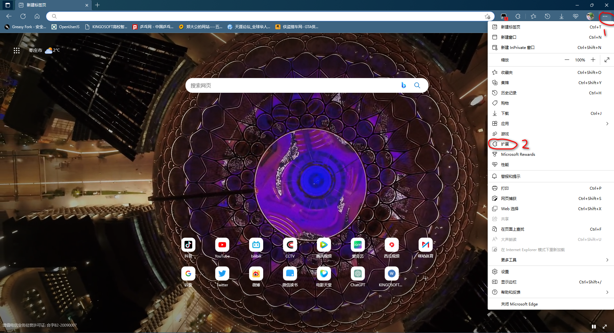

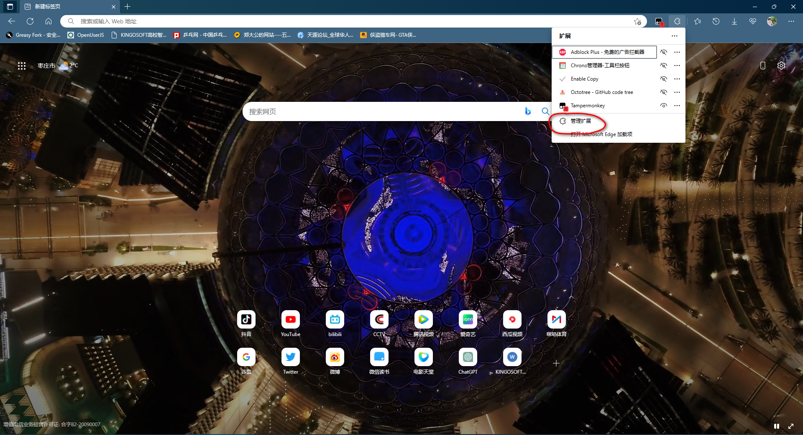

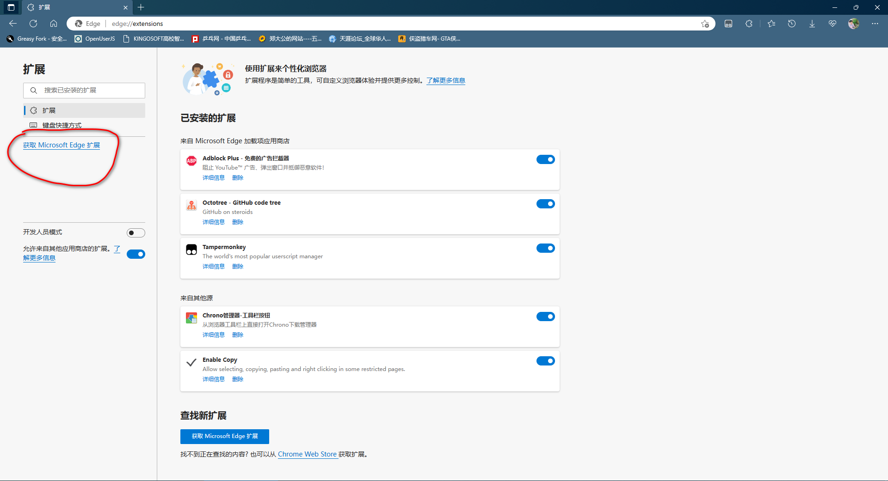

输入插件名称后按回车，然后选择相应的插件安装，如下图

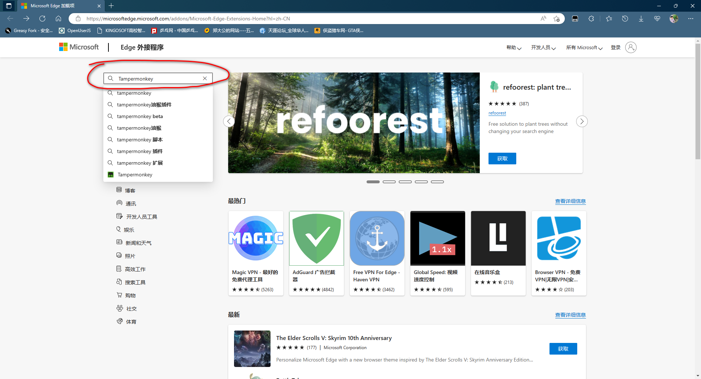

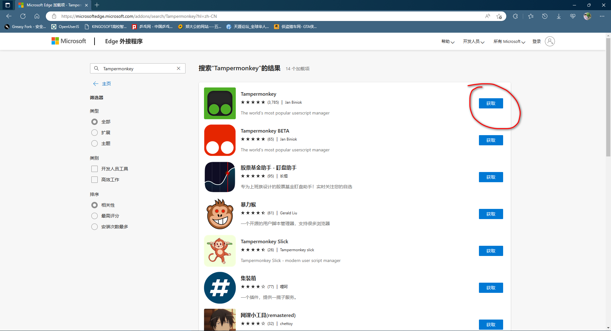

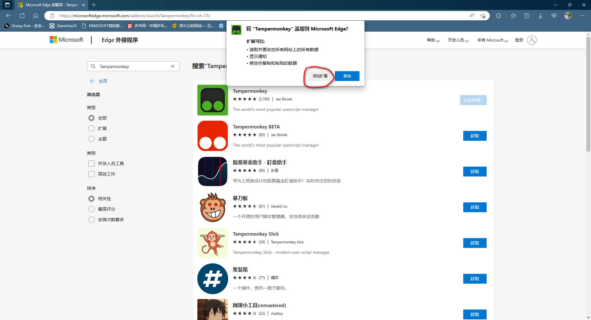

安装完成如下界面，直接关闭就好。

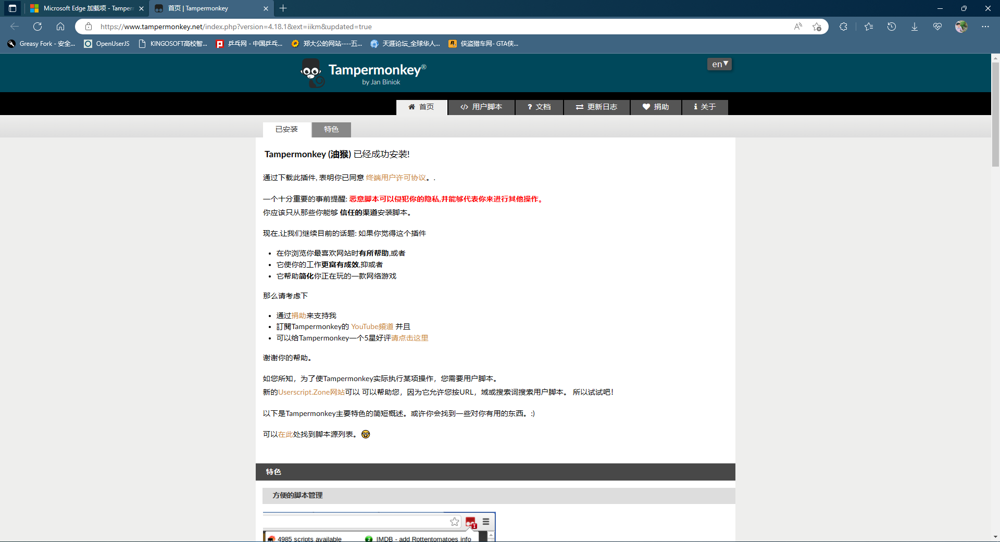

### 2、安装合适的脚本
输入上面的Greasyfork网址，打开网站如下图

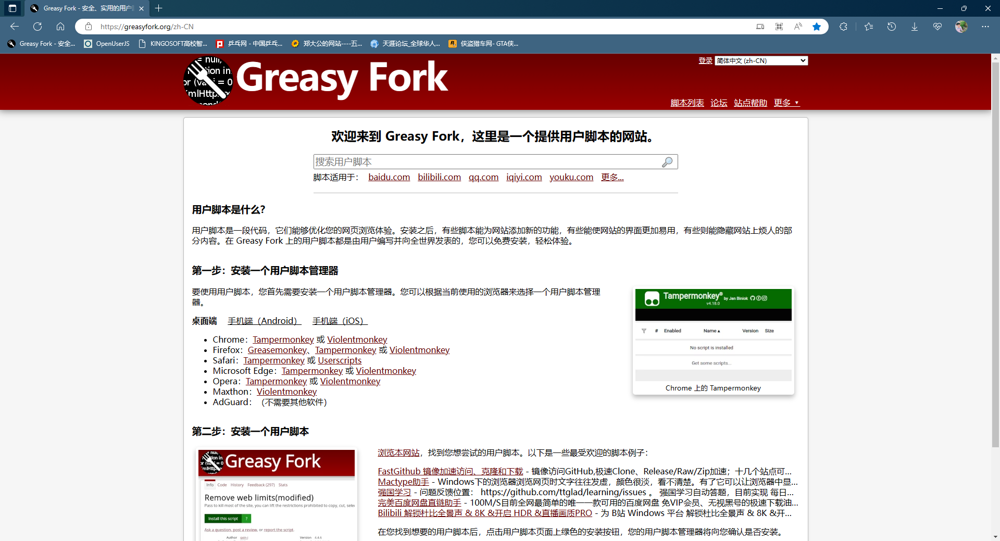

输入自己需要功能的关键词并回车，搜索相应的脚本

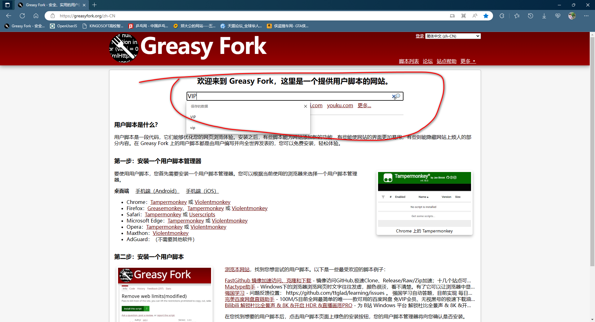

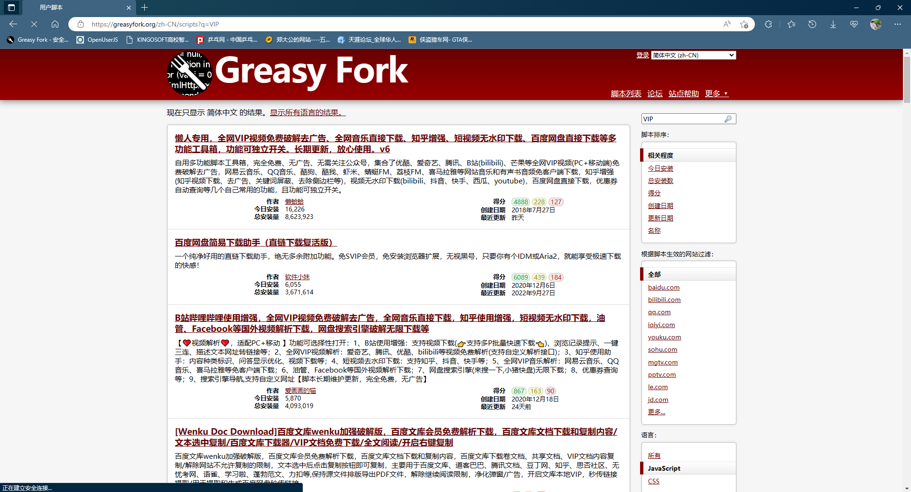

选一个合适的点击标题，然后安装，如下图

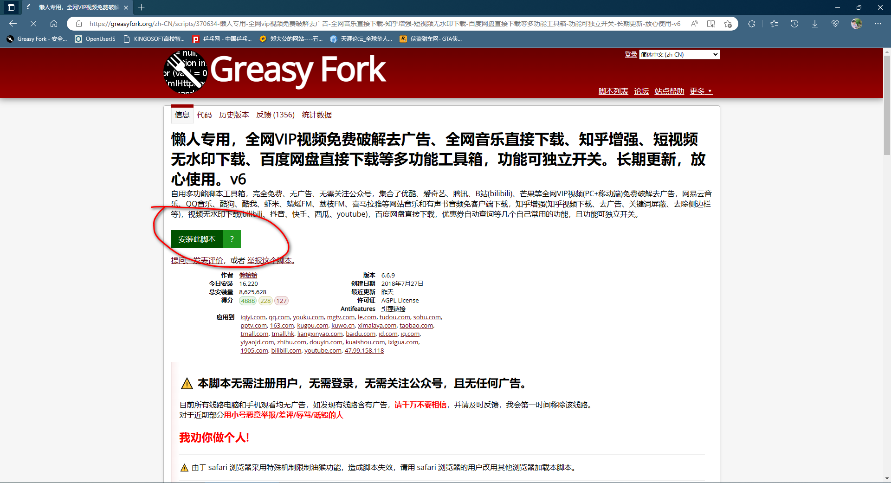

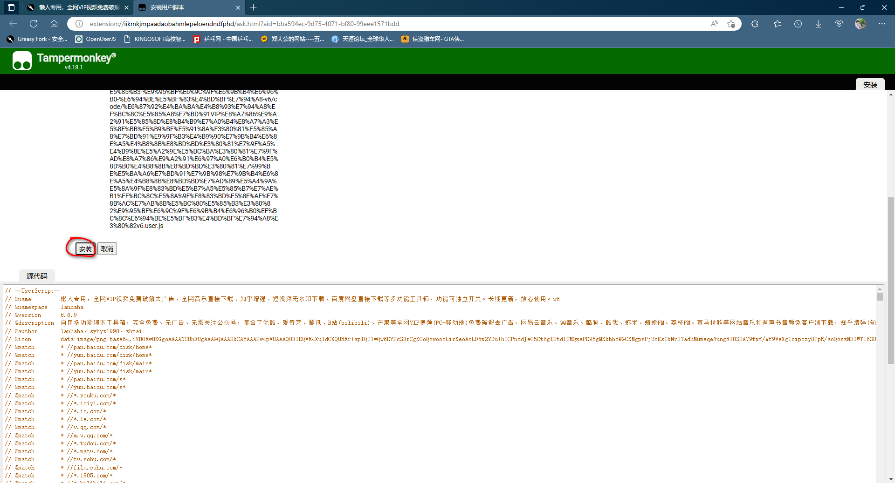

### 3、使用扩展功能
经过上面的步骤，脚本的功能就可以正常使用了，下面演示如何使用。
正常打开一个视频平台

随便挑一个vip资源，正常情况下只能试看5分钟。我们点击插件入口，如下图

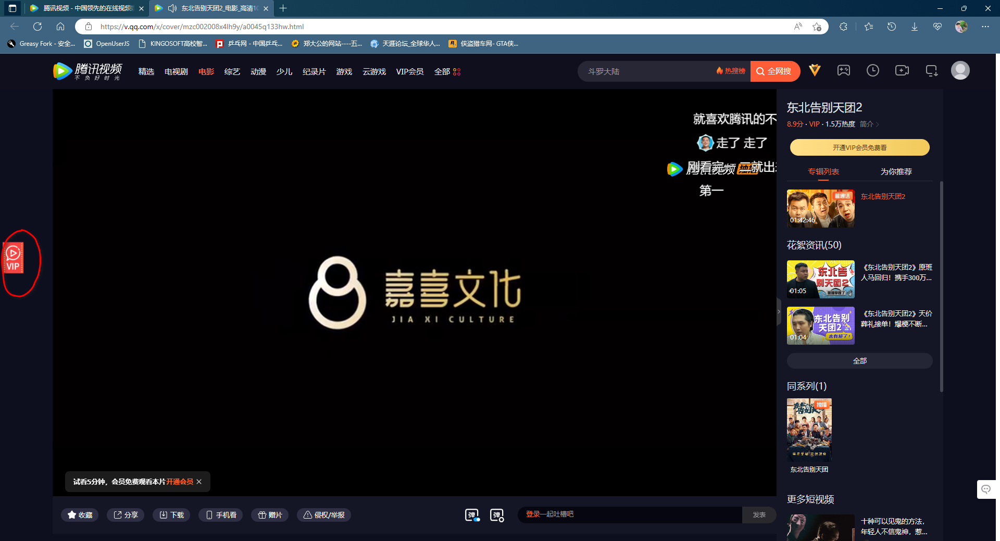

选择合适的和资源池点击，然后就能正常播放了

如果您乐意，感谢支持~

